# 📘 Shehab Note - Complete Technical Documentation

> **A Privacy-First, Self-Hosted Personal Knowledge Management System**

---

## Table of Contents

1. [Installation & Setup Guide](#1-installation--setup-guide)
2. [System Architecture & Data Flow](#2-system-architecture--data-flow)
3. [File-Level I/O Documentation](#3-file-level-io-documentation)
4. [Application Guidelines & Workflow](#4-application-guidelines--workflow)
5. [Operational Logic](#5-operational-logic)

---

## 1. Installation & Setup Guide

### 📋 Prerequisites

#### Environment Requirements

| Component | Minimum Version | Recommended |
|-----------|-----------------|-------------|
| **Node.js** | 18.x | 21.x |
| **pnpm** | 10.22.0 | Latest |
| **Go** | 1.25.4 | 1.25.x |
| **Git** | 2.x | Latest |
| **Docker** (optional) | 20.x | Latest |

#### System Requirements

| Platform | RAM | Storage | CPU |
|----------|-----|---------|-----|
| Desktop (any OS) | 4GB+ | 500MB+ | Dual-core |
| Server/Docker | 2GB+ | 1GB+ | Any |

#### Dependencies

**Frontend (Node.js/TypeScript):**
- Electron 39.2.7
- Webpack 5.94.0
- TypeScript 4.7.4
- SCSS/Sass for styling

**Backend (Go):**
- Gin web framework
- SQLite3 with FTS5 (Full-Text Search)
- WebSocket support via Gorilla
- Lute Markdown engine

---

### 🖥️ Installation Instructions

#### Windows

```powershell
# 1. Clone the repository
git clone https://github.com/Drmusab/shehab-note.git
cd shehab-note

# 2. Install Node.js dependencies and build frontend
cd app
npm install -g pnpm
pnpm install
pnpm run build

# 3. Build the Go kernel
cd ../kernel
go build --tags fts5 -o shehab-kernel. exe

# 4. Run the application
# Start the kernel first
.\shehab-kernel.exe --workspace="C:\Users\YourName\shehab-workspace"

# Then launch Electron app (from /app directory)
cd ../app
pnpm start
```

#### macOS

```bash
# 1. Install Homebrew dependencies (if needed)
brew install node go

# 2. Clone and enter repository
git clone https://github.com/Drmusab/shehab-note.git
cd shehab-note

# 3. Build frontend
cd app
npm install -g pnpm
pnpm install
pnpm run build

# 4. Build Go kernel
cd ../kernel
go build --tags fts5 -o shehab-kernel

# 5. Run the application
./shehab-kernel --workspace="$HOME/shehab-workspace" &
cd ../app && pnpm start
```

#### Linux

```bash
# 1. Install dependencies (Ubuntu/Debian)
sudo apt update
sudo apt install -y nodejs npm golang-go gcc

# 2. Clone repository
git clone https://github.com/Drmusab/shehab-note. git
cd shehab-note

# 3. Install pnpm and build frontend
npm install -g pnpm
cd app
pnpm install
pnpm run build

# 4. Build Go kernel (requires CGO for SQLite)
cd ../kernel
CGO_ENABLED=1 go build --tags fts5 -o shehab-kernel

# 5. Run application
./shehab-kernel --workspace="$HOME/shehab-workspace" &
cd ../app && pnpm start
```

#### Docker Deployment

```bash
# Using Docker Compose
docker run -d \
  -v /path/to/workspace:/siyuan/workspace \
  -p 6806:6806 \
  -e PUID=1000 -e PGID=1000 \
  b3log/siyuan \
  --workspace=/siyuan/workspace/ \
  --accessAuthCode=your_secret_code
```

**Docker Compose Example:**

```yaml
version: "3.9"
services:
  shehab: 
    image: b3log/siyuan
    command: ['--workspace=/siyuan/workspace/', '--accessAuthCode=${AUTH_CODE}']
    ports:
      - 6806:6806
    volumes:
      - ./workspace:/siyuan/workspace
    restart: unless-stopped
    environment:
      - TZ=UTC
      - PUID=1000
      - PGID=1000
```

---

### 🔧 Troubleshooting Common Setup Issues

| Issue | Cause | Solution |
|-------|-------|----------|
| `go build` fails with SQLite errors | Missing CGO support | Set `CGO_ENABLED=1` and ensure GCC is installed |
| `pnpm install` permission errors | Global package permissions | Use `npm config set prefix ~/. npm-global` |
| Electron fails to start | Missing display server | For headless:  install `xvfb` or use Docker |
| Port 6806 already in use | Another instance running | Kill existing process or change port with `--port=XXXX` |
| Database locked errors | Concurrent access | Ensure only one kernel instance per workspace |
| Font rendering issues | Missing fonts | Install `fonts-noto` package on Linux |

---

## 2. System Architecture & Data Flow

### 🏗️ High-Level Architecture

Shehab Note follows a **Client-Server Monolith** architecture with the following characteristics:

- **Frontend**:  Electron + TypeScript SPA (Single Page Application)
- **Backend**: Go HTTP/WebSocket server (the "Kernel")
- **Database**: SQLite with FTS5 for full-text search
- **Storage**: Local file system with JSON document format


### 📊 Data Flow Diagram


### 🔄 Component Interaction Flow


---

## 3. File-Level I/O Documentation

### 📁 Frontend Core Files (app/src/)

| File Name | Purpose | Input(s) | Key Logic/Functions | Output(s) |
|-----------|---------|----------|---------------------|-----------|
| `index.ts` | Application entry point | Config, DOM | `App` class, Service Worker registration, WebSocket init | Initialized app instance |
| `constants.ts` | Global constants definition | None | Version strings, API paths, storage keys | Constant values |
| `protyle/index.ts` | WYSIWYG Editor core | Block ID, options | `Protyle` class, `transaction()`, `insert()`, `destroy()` | Editor instance with full editing capabilities |
| `protyle/wysiwyg/index.ts` | Content editing layer | User events, DOM | Paste handling, block operations, selection | DOM mutations, transactions |
| `protyle/wysiwyg/transaction.ts` | Transaction management | Operations array | `transaction()`, `turnsIntoTransaction()` | API calls, undo stack updates |
| `protyle/undo/index.ts` | Undo/Redo stack | Operations | `Undo. add()`, `Undo.undo()`, `Undo.redo()` | State restoration |
| `layout/index.ts` | Window layout manager | Layout JSON config | `Layout` class, split panes, tabs | Layout DOM structure |
| `layout/Model.ts` | Base model for panels | WebSocket data | Message handling, sync state | UI updates |
| `layout/Tab.ts` | Tab management | Tab config | Tab creation, switching, closing | Tab DOM elements |
| `layout/dock/Files.ts` | File tree panel | Notebook data | File listing, drag-drop, context menu | File tree UI |
| `plugin/index.ts` | Plugin system core | Plugin manifests | `Plugin` class, `loadData()`, `saveData()` | Plugin instances |
| `plugin/loader.ts` | Plugin loader | Plugin code | `loadPlugins()`, sandboxed execution | Loaded plugins |
| `editor/index.ts` | Document editor wrapper | Block/Root ID | `Editor` class wrapping Protyle | Full editor with model binding |
| `util/fetch.ts` | HTTP client utilities | URL, params | `fetchPost()`, `fetchGet()`, `fetchSyncPost()` | API responses |
| `mobile/index.ts` | Mobile app entry | Config | Mobile-specific `App` class | Mobile app instance |
| `window/index.ts` | Desktop window manager | Window config | Multi-window support, IPC | Window instances |
| `search/index.ts` | Search functionality | Query string | Full-text search, filters | Search results |
| `ai/chat. ts` | AI integration | Prompts | OpenAI API calls, chat interface | AI responses |

### 📁 Backend Core Files (kernel/)

| File Name | Purpose | Input(s) | Key Logic/Functions | Output(s) |
|-----------|---------|----------|---------------------|-----------|
| `main.go` | Application entry | CLI flags | Kernel initialization, server start | Running server |
| `server/serve.go` | HTTP server setup | Port, config | `Serve()`, route registration, middleware | HTTP/WS server |
| `api/router.go` | API route definitions | Gin engine | `ServeAPI()`, 500+ endpoints | Registered routes |
| `api/block.go` | Block CRUD operations | JSON requests | Insert, update, delete blocks | JSON responses |
| `api/filetree.go` | File tree operations | Path, IDs | Document CRUD, move, rename | File operations |
| `api/transaction.go` | Transaction processing | Operation arrays | Batch operations, atomicity | Transaction results |
| `api/search.go` | Search endpoints | Query params | Full-text search, SQL queries | Search results |
| `api/export.go` | Export functionality | Doc IDs, format | PDF, Markdown, HTML export | Exported files |
| `model/box.go` | Notebook model | Notebook ID | `Box` struct, `GetInfo()`, file listing | Notebook data |
| `model/file.go` | Document model | File paths | `File` struct, document metadata | File objects |
| `model/storage.go` | Local storage | Key-value pairs | `SetLocalStorage()`, `GetLocalStorage()` | Persisted data |
| `model/transaction.go` | Transaction logic | Operations | `PerformTransactions()`, conflict resolution | Applied changes |
| `sql/database.go` | Database management | None | `InitDatabase()`, `initDBTables()` | SQLite connection |
| `sql/block.go` | Block queries | Block IDs | `GetBlock()`, `UpdateBlock()`, FTS5 search | Block data |
| `filesys/tree.go` | Document tree I/O | File paths | `LoadTree()`, `WriteTree()`, JSON parsing | Parse trees |
| `treenode/blocktree.go` | Block tree index | Block data | In-memory block index, fast lookups | Block references |
| `util/working.go` | Workspace utilities | Paths | Path resolution, workspace init | Workspace paths |
| `util/file.go` | File utilities | File data | `DataSize()`, file operations | File stats |
| `cache/cache.go` | Caching layer | Various data | Ristretto cache implementation | Cached data |
| `search/search.go` | Search engine | Queries | FTS5 queries, result ranking | Ranked results |

### 📁 Configuration Files

| File Name | Purpose | Input(s) | Key Logic/Functions | Output(s) |
|-----------|---------|----------|---------------------|-----------|
| `app/package.json` | Frontend dependencies | npm registry | Dependency resolution, scripts | node_modules |
| `kernel/go. mod` | Go module definition | Go modules | Dependency management | Compiled binaries |
| `Dockerfile` | Container build | Source code | Multi-stage build (Node + Go) | Docker image |
| `app/electron/main.js` | Electron main process | CLI args | Window creation, IPC | Desktop app window |
| `app/webpack.config.js` | Webpack bundling | Source files | Bundle optimization | Production bundles |

---

## 4. Application Guidelines & Workflow

### 📐 Coding Standards and Best Practices

#### TypeScript/JavaScript (Frontend)

```typescript
// ✅ DO: Use strong typing
interface IBlockData {
    id: string;
    type: BlockType;
    content: string;
    children?: IBlockData[];
}

// ✅ DO: Use async/await for API calls
async function fetchBlock(id: string): Promise<IBlockData> {
    const response = await fetchPost('/api/block/getBlockInfo', { id });
    return response.data;
}

// ✅ DO: Use transactions for state changes
transaction(protyle, [
    { action: 'update', id: blockId, data: newContent }
], [
    { action:  'update', id: blockId, data: oldContent }  // undo operation
]);

// ❌ DON'T:  Mutate state directly
// block.content = newContent;  // Wrong! 
```

#### Go (Backend)

```go
// ✅ DO: Use structured error handling
func GetBlock(id string) (*Block, error) {
    if ! ast.IsNodeIDPattern(id) {
        return nil, errors.New("invalid block ID format")
    }
    // ... implementation
}

// ✅ DO: Use proper locking for concurrent access
var blockMutex sync.RWMutex

func UpdateBlock(block *Block) error {
    blockMutex.Lock()
    defer blockMutex.Unlock()
    // ... implementation
}

// ✅ DO:  Log appropriately
logging.LogInfof("processing block [%s]", blockID)
```

#### Project Conventions

| Category | Convention |
|----------|------------|
| **File Naming** | `camelCase. ts` for TypeScript, `snake_case.go` for Go |
| **Component Naming** | PascalCase for classes:  `class Protyle`, `class BlockPanel` |
| **API Endpoints** | RESTful:  `POST /api/{resource}/{action}` |
| **Constants** | SCREAMING_SNAKE_CASE: `LOCAL_STORAGE_KEY` |
| **CSS Classes** | BEM-like: `protyle-wysiwyg--attr`, `b3-dialog__container` |

---

### 🛤️ Happy Path:  User Journey

```mermaid
flowchart LR
    subgraph Start["🚀 Application Start"]
        A1[Launch App] --> A2[Load Workspace]
        A2 --> A3[Initialize Kernel]
        A3 --> A4[Load Notebooks]
    end
    
    subgraph Create["📝 Create Document"]
        B1[Click New Document] --> B2[Enter Title]
        B2 --> B3[Document Created]
        B3 --> B4[Editor Opens]
    end
    
    subgraph Edit["✏️ Edit Content"]
        C1[Type Content] --> C2[Markdown Parsed]
        C2 --> C3[Block Created]
        C3 --> C4[Transaction Sent]
        C4 --> C5[Saved to Disk]
    end
    
    subgraph Organize["📂 Organize"]
        D1[Create Links] --> D2[Add Tags]
        D2 --> D3[Move to Folder]
        D3 --> D4[Search & Find]
    end
    
    subgraph Export["📤 Export"]
        E1[Select Format] --> E2[Configure Options]
        E2 --> E3[Generate Output]
        E3 --> E4[Download File]
    end
    
    A4 --> B1
    B4 --> C1
    C5 --> D1
    D4 --> E1
```



#### Detailed Happy Path Steps

1. **Application Launch**
   - User launches Shehab Note
   - Kernel starts and initializes workspace
   - Database connections established
   - UI renders with file tree and welcome page

2. **Create New Document**
   - User clicks "New Document" in file tree
   - Modal prompts for document title
   - `.sy` file created in workspace
   - Document indexed in SQLite
   - Editor opens with empty content

3. **Content Editing**
   - User types in Protyle editor
   - Lute parses Markdown in real-time
   - Content blocks created with unique IDs
   - Transactions batched and sent to kernel
   - File saved, index updated

4. **Block Linking & References**
   - User types `((` to trigger block search
   - Select target block from suggestions
   - Bidirectional link established
   - Backlinks panel updated

5. **Search & Navigation**
   - User presses `Ctrl+P` for quick open
   - Full-text search across all documents
   - Click result to navigate
   - Breadcrumb shows current location

6. **Export & Share**
   - User selects Export from menu
   - Choose format (Markdown, PDF, HTML)
   - Configure export options
   - File generated and downloaded

---

## 5. Operational Logic

### ⚙️ Core Engine Deep Dive

#### The Protyle Editor Engine

The Protyle editor is the heart of Shehab Note's user experience. It's a block-based WYSIWYG editor that seamlessly handles Markdown. 


**Key Components:**

| Component | File | Responsibility |
|-----------|------|----------------|
| **Protyle** | `protyle/index.ts` | Main editor class, lifecycle management |
| **WYSIWYG** | `protyle/wysiwyg/index.ts` | Content editing, event handling |
| **Toolbar** | `protyle/toolbar/index. ts` | Formatting buttons, actions |
| **Gutter** | `protyle/gutter/index.ts` | Block-level operations, drag handles |
| **Hint** | `protyle/hint/index.ts` | Autocomplete, slash commands |
| **Undo** | `protyle/undo/index. ts` | Undo/redo stack management |
| **Upload** | `protyle/upload/index. ts` | Asset upload handling |

#### Transaction System

The transaction system ensures data consistency and enables undo/redo functionality.

```typescript
// Transaction Structure
interface IOperation {
    action: 'insert' | 'update' | 'delete' | 'move' | 'foldHeading' | ... ;
    id: string;           // Block ID
    data?:  string;        // New content
    parentID?: string;    // For hierarchy changes
    previousID?: string;  // For ordering
    // ... additional fields based on action
}

// Transaction Flow
1. User makes edit in Protyle
2. Operation objects created for each change
3. Undo operations generated (inverse)
4. Transaction sent to kernel via POST /api/transactions
5. Kernel processes atomically
6. Success:  Undo stack updated
7.  Failure: Operations rolled back
8. WebSocket broadcasts changes to other views
```

#### Block Storage Model

Documents are stored as JSON files (`.sy` extension) with a hierarchical block structure:

```json
{
    "ID": "20240103120000-abc123x",
    "Type": "NodeDocument",
    "Properties": {
        "id": "20240103120000-abc123x",
        "title": "My Document",
        "updated": "20240103121500"
    },
    "Children": [
        {
            "ID": "20240103120001-def456y",
            "Type":  "NodeParagraph",
            "Properties": {
                "id": "20240103120001-def456y"
            },
            "Data": "This is a paragraph with **bold** text."
        },
        {
            "ID": "20240103120002-ghi789z",
            "Type":  "NodeList",
            "ListData": {"Typ": 0},
            "Children": [...]
        }
    ]
}
```

#### SQLite Index Schema

The kernel maintains a SQLite database for fast queries: 

```sql
-- Main blocks table (with FTS5 for full-text search)
CREATE TABLE blocks (
    id TEXT PRIMARY KEY,
    parent_id TEXT,
    root_id TEXT,
    hash TEXT,
    box TEXT,           -- Notebook ID
    path TEXT,          -- File path
    hpath TEXT,         -- Human-readable path
    name TEXT,
    alias TEXT,
    memo TEXT,
    tag TEXT,
    content TEXT,       -- Plain text content
    fcontent TEXT,      -- First content (for list items)
    markdown TEXT,      -- Original markdown
    length INTEGER,
    type TEXT,          -- Block type
    subtype TEXT,
    ial TEXT,           -- Inline Attribute List (JSON)
    sort INTEGER,
    created TEXT,
    updated TEXT
);

-- FTS5 virtual table for full-text search
CREATE VIRTUAL TABLE blocks_fts USING fts5(
    content, 
    content='blocks', 
    content_rowid='rowid'
);
```

#### API Request Lifecycle


#### WebSocket Real-time Communication

The WebSocket system enables real-time synchronization across multiple windows/tabs:

```go
// Message types handled by WebSocket
switch data. Cmd {
    case "reload":           // Document needs refresh
    case "rename":           // Document renamed
    case "setAppearance":    // Theme/appearance changed
    case "transactions":     // Block changes from other views
    case "refreshAttrView":  // Database view updated
    case "heading2doc":      // Heading converted to document
    // ... many more
}
```

#### Plugin Architecture

Plugins extend Shehab Note's functionality through a sandboxed API:

```typescript
// Plugin lifecycle
class MyPlugin extends Plugin {
    onload() {
        // Called when plugin loads
        this.addCommand({... });
        this.addDock({...});
    }
    
    onunload() {
        // Cleanup when disabled
    }
    
    // Data persistence
    await this.saveData('config. json', myConfig);
    const config = await this.loadData('config.json');
}
```

**Plugin Capabilities:**
- Add custom slash commands
- Register dock panels
- Listen to events via EventBus
- Call internal APIs
- Store data in workspace
- Add toolbar buttons
- Custom keyboard shortcuts

---

### 🔒 Security Considerations

| Feature | Implementation |
|---------|----------------|
| **Access Auth Code** | Required for remote access, configurable |
| **Session Management** | Cookie-based sessions with secure tokens |
| **API Authentication** | Bearer token in Authorization header |
| **Path Traversal Prevention** | Workspace boundary enforcement |
| **XSS Protection** | HTML sanitization in Lute parser |
| **CSRF Protection** | Token-based request validation |

---

### 📈 Performance Optimizations

1. **Virtual Scrolling**:  Large documents render only visible blocks
2. **Lazy Loading**:  Blocks load on-demand as user scrolls
3. **Transaction Batching**: Multiple edits grouped into single API call
4. **In-Memory Cache**: Ristretto cache for frequently accessed data
5. **FTS5 Indexing**: Full-text search without scanning files
6. **WebP Image Conversion**: Automatic image optimization

---

## Appendix:  Quick Reference

### Common API Endpoints

| Endpoint | Method | Purpose |
|----------|--------|---------|
| `/api/system/getConf` | POST | Get system configuration |
| `/api/block/getBlockInfo` | POST | Get block details |
| `/api/block/updateBlock` | POST | Update block content |
| `/api/filetree/createDoc` | POST | Create new document |
| `/api/search/fullTextSearchBlock` | POST | Full-text search |
| `/api/export/exportMd` | POST | Export as Markdown |
| `/ws/broadcast` | WebSocket | Real-time updates |

### Environment Variables

| Variable | Default | Description |
|----------|---------|-------------|
| `SIYUAN_WORKSPACE_PATH` | - | Workspace directory path |
| `SIYUAN_ACCESS_AUTH_CODE` | - | Access authentication code |
| `PUID` | 1000 | User ID for Docker |
| `PGID` | 1000 | Group ID for Docker |
| `TZ` | Asia/Shanghai | Timezone |

---

*Documentation generated for Shehab Note v3.5.2*
*Repository: [Drmusab/shehab-note](https://github.com/Drmusab/shehab-note)*## 💡 Introduction

**Shehab** is a fork of [SiYuan](https://github.com/siyuan-note/siyuan) focused on privacy-first, local-first personal knowledge management with fine-grained block-level reference and Markdown WYSIWYG.

This fork removes cloud-dependent features to create a streamlined, local-first experience while maintaining all the powerful features of the original SiYuan project.

### What's Different?

- **No Cloud Sync**: All cloud synchronization features have been removed for a truly local-first experience
- **Simplified**: Focus on core note-taking functionality without external dependencies
- **Privacy-First**: Your data stays on your machine

### Original SiYuan Project

This is a fork of the excellent [SiYuan](https://github.com/siyuan-note/siyuan) project. Please visit the original project for:
- Full feature set including cloud sync
- Official support and community
- Original documentation

---

## Table of Contents

* [💡 Introduction](#-introduction)
* [🔮 Features](#-features)
* [🏗️ Architecture and Ecosystem](#-architecture-and-ecosystem)
* [🌟 Star History](#-star-history)
* [🗺️ Roadmap](#️-roadmap)
* [🚀 Download Setup](#-download-setup)
  * [App Market](#app-market)
  * [Installation Package](#installation-package)
  * [Package Manager](#package-manager)
  * [Docker Hosting](#docker-hosting)
  * [Unraid Hosting](#unraid-hosting)
  * [TrueNAS Hosting](#TrueNAS-hosting)
  * [Insider Preview](#insider-preview)
* [🏘️ Community](#️-community)
* [🛠️ Development Guide](#️-development-guide)
* [❓ FAQ](#-faq)
  * [How does Shehab store data?](#how-does-siyuan-store-data)
  * [Does it support data synchronization through a third-party sync disk?](#does-it-support-data-synchronization-through-a-third-party-sync-disk)
  * [Is Shehab open source?](#is-siyuan-open-source)
  * [How to upgrade to a new version?](#how-to-upgrade-to-a-new-version)
  * [What if some blocks (such as paragraph blocks in list items) cannot find the block icon?](#what-if-some-blocks-such-as-paragraph-blocks-in-list-items-cannot-find-the-block-icon)
  * [What should I do if the data repo key is lost?](#what-should-i-do-if-the-data-repo-key-is-lost)
  * [Do I need to pay for it?](#do-i-need-to-pay-for-it)
* [🙏 Acknowledgement](#-acknowledgement)
  * [Contributors](#contributors)

---

## 💡 Introduction

**Shehab** is a fork of [SiYuan](https://github.com/siyuan-note/siyuan) focused on privacy-first, local-first personal knowledge management with fine-grained block-level reference and Markdown WYSIWYG.

This fork removes cloud-dependent features to create a streamlined, local-first experience while maintaining all the powerful features of the original SiYuan project.

### What's Different?

- **No Cloud Sync**: All cloud synchronization features have been removed for a truly local-first experience
- **Simplified**: Focus on core note-taking functionality without external dependencies
- **Privacy-First**: Your data stays on your machine

### Original SiYuan Project

This is a fork of the excellent [SiYuan](https://github.com/siyuan-note/siyuan) project. Please visit the original project for:
- Full feature set including cloud sync
- Official support and community
- Original documentation

Welcome to explore Shehab's streamlined, local-first approach to knowledge management.


## 🔮 Features

All features are free for personal and commercial use.

* Content block
  * Block-level reference and two-way links
  * Custom attributes
  * SQL query embed
  * Protocol `shehab://`
* Editor
  * Block-style
  * Markdown WYSIWYG
  * List outline
  * Block zoom-in
  * Million-word large document editing
  * Mathematical formulas, charts, flowcharts, Gantt charts, timing charts, staffs, etc.
  * Web clipping
  * PDF Annotation link
* Export
  * Block ref and embed
  * Standard Markdown with assets
  * PDF, Word and HTML
  * Copy to WeChat MP, Zhihu and Yuque
* Database
  * Table view
* Flashcard spaced repetition
* AI writing and Q/A chat via OpenAI API
* Tesseract OCR 
* Multi-tab, drag and drop to split screen
* Template snippet
* JavaScript/CSS snippet
* Android/iOS/HarmonyOS App
* Docker deployment
* [API](https://github.com/siyuan-note/siyuan/blob/master/API.md)
* Community marketplace

**Note:** This is a local-first fork without cloud sync features. For cloud synchronization, please refer to the original [SiYuan project](https://github.com/siyuan-note/siyuan).

## 🏗️ Architecture and Ecosystem

**Note:** Shehab is a fork of SiYuan. The ecosystem projects below are maintained by the original SiYuan team.


| Project                                                  | Description           | Maintained By |
|----------------------------------------------------------|-----------------------|---------------|
| [lute](https://github.com/88250/lute)                    | Editor engine         | SiYuan Team   |
| [chrome](https://github.com/siyuan-note/siyuan-chrome)   | Chrome/Edge extension | SiYuan Team   |
| [bazaar](https://github.com/siyuan-note/bazaar)          | Community marketplace | SiYuan Team   |
| [dejavu](https://github.com/siyuan-note/dejavu)          | Data repo             | SiYuan Team   |
| [petal](https://github.com/siyuan-note/petal)            | Plugin API            | SiYuan Team   |
| [android](https://github.com/siyuan-note/siyuan-android) | Android App           | SiYuan Team   |
| [ios](https://github.com/siyuan-note/siyuan-ios)         | iOS App               | SiYuan Team   |
| [harmony](https://github.com/siyuan-note/siyuan-harmony) | HarmonyOS App         | SiYuan Team   |
| [riff](https://github.com/siyuan-note/riff)              | Spaced repetition     | SiYuan Team   |

## 🚀 Download and Installation

This is a source-only distribution. To use Shehab, you need to build it from source:

```bash
# Build the app
cd app && pnpm install && pnpm run build

# Build the kernel
cd kernel && go build --tags fts5
```

For pre-built binaries and easier installation, please use the original [SiYuan project](https://github.com/siyuan-note/siyuan).

<details>
<summary>Docker Deployment</summary>

#### Overview

The easiest way to serve SiYuan on a server is to deploy it through Docker.

* Image name `b3log/siyuan`
* [Image URL](https://hub.docker.com/r/b3log/siyuan)

#### File structure

The overall program is located under `/opt/siyuan/`, which is basically the structure under the resources folder of the Electron installation package:

* appearance: icon, theme, languages
* guide: user guide document
* stage: interface and static resources
* kernel: kernel program

#### Entrypoint

The entry point is set when building the Docker image: `ENTRYPOINT ["/opt/siyuan/entrypoint.sh"]`. This script allows changing the `PUID` and `PGID` of the user that will run inside the container. This is especially relevant to solve permission issues when mounting directories from the host. The `PUID` (User ID) and `PGID` (Group ID) can be passed as environment variables, making it easier to ensure correct permissions when accessing host-mounted directories.

Use the following parameters when running the container with `docker run b3log/siyuan`:

* `--workspace`: Specifies the workspace folder path, mounted to the container via `-v` on the host
* `--accessAuthCode`: Specifies the access authorization code

More parameters can be found using `--help`. Here’s an example of a startup command with the new environment variables:

```bash
docker run -d \
  -v workspace_dir_host:workspace_dir_container \
  -p 6806:6806 \
  -e PUID=1001 -e PGID=1002 \
  b3log/siyuan \
  --workspace=workspace_dir_container \
  --accessAuthCode=xxx
```

* `PUID`: Custom user ID (optional, defaults to `1000` if not provided)
* `PGID`: Custom group ID (optional, defaults to `1000` if not provided)
* `workspace_dir_host`: The workspace folder path on the host
* `workspace_dir_container`: The path of the workspace folder in the container, as specified in `--workspace`
  * In alternative, it's possible to set the path via the `SIYUAN_WORKSPACE_PATH` env variable. The commandline will always have the priority, if both are set
* `accessAuthCode`: Access authorization code (please **be sure to modify**, otherwise anyone can access your data)
  * In alternative, it's possible to set the auth code via the `SIYUAN_ACCESS_AUTH_CODE` env variable. The commandline will always have the priority, if both are set
  * To disable the Access authorization code set the env variable `SIYUAN_ACCESS_AUTH_CODE_BYPASS=true`

To simplify things, it is recommended to configure the workspace folder path to be consistent on the host and container, such as having both `workspace_dir_host` and `workspace_dir_container` configured as `/siyuan/workspace`. The corresponding startup command would be:

```bash
docker run -d \
  -v /siyuan/workspace:/siyuan/workspace \
  -p 6806:6806 \
  -e PUID=1001 -e PGID=1002 \
  b3log/siyuan \
  --workspace=/siyuan/workspace/ \
  --accessAuthCode=xxx
```

#### Docker Compose

For users running Siyuan with Docker Compose, the environment variables `PUID` and `PGID` can be passed to customize the user and group IDs. Here's an example of a Docker Compose configuration:

```yaml
version: "3.9"
services:
  main:
    image: b3log/siyuan
    command: ['--workspace=/siyuan/workspace/', '--accessAuthCode=${AuthCode}']
    ports:
      - 6806:6806
    volumes:
      - /siyuan/workspace:/siyuan/workspace
    restart: unless-stopped
    environment:
      # A list of time zone identifiers can be found at https://en.wikipedia.org/wiki/List_of_tz_database_time_zones
      - TZ=${YOUR_TIME_ZONE}
      - PUID=${YOUR_USER_PUID}  # Customize user ID
      - PGID=${YOUR_USER_PGID}  # Customize group ID
```

In this setup:

* `PUID` and `PGID` are set dynamically and passed to the container
* If these variables are not provided, the default `1000` will be used

By specifying `PUID` and `PGID` in the environment, you avoid the need to explicitly set the `user` directive (`user: '1000:1000'`) in the compose file. The container will dynamically adjust the user and group based on these environment variables at startup.

#### User Permissions

In the image, the `entrypoint.sh` script ensures the creation of the `siyuan` user and group with the specified `PUID` and `PGID`. Therefore, when the host creates a workspace folder, pay attention to setting the user and group ownership of the folder to match the `PUID` and `PGID` you plan to use. For example:

```bash
chown -R 1001:1002 /siyuan/workspace
```

If you use custom `PUID` and `PGID` values, the entrypoint script will ensure that the correct user and group are created inside the container, and ownership of mounted volumes will be adjusted accordingly. There’s no need to manually pass `-u` in `docker run` or `docker-compose` as the environment variables will handle the customization.

#### Hidden port

Use NGINX reverse proxy to hide port 6806, please note:

* Configure WebSocket reverse proxy `/ws`

#### Note

* Be sure to confirm the correctness of the mounted volume, otherwise the data will be lost after the container is deleted
* Do not use URL rewriting for redirection, otherwise there may be problems with authentication, it is recommended to configure a reverse proxy
* If you encounter permission issues, verify that the `PUID` and `PGID` environment variables match the ownership of the mounted directories on your host system

#### Limitations

* Does not support desktop and mobile application connections, only supports use on browsers
* Export to PDF, HTML and Word formats is not supported
* Import Markdown file is not supported

</details>

### Unraid Hosting

<details>
<summary>Unraid Deployment</summary>

Note: First run `chown -R 1000:1000 /mnt/user/appdata/shehab` in the terminal

Template reference:

```
Web UI: 6806
Container Port: 6806
Container Path: /home/shehab
Host path: /mnt/user/appdata/shehab
PUID: 1000
PGID: 1000
Publish parameters: --accessAuthCode=******(Access authorization code)
```

</details>

### TrueNAS Hosting

<details>
<summary>TrueNAS Deployment</summary>

Note: First run below commands in the TrueNAS Shell. please update `Pool_1/Apps_Data/shehab` to match your dataset for Apps.

```shell
zfs create Pool_1/Apps_Data/shehab
chown -R 1001:1002 /mnt/Pool_1/Apps_Data/shehab
chmod 755 /mnt/Pool_1/Apps_Data/shehab
```

Navigate to Apps - DiscoverApps - More Options(on top right, besies Custom App) - Install via YAML

Template reference:

```yaml
services:
  shehab:
    image: shehab:latest
    container_name: shehab
    command: ['--workspace=/shehab/workspace/', '--accessAuthCode=2222']
    ports:
      - 6806:6806
    volumes:
      - /mnt/Pool_1/Apps_Data/shehab:/shehab/workspace  # Adjust to your dataset path 
    restart: unless-stopped
    environment:
      - TZ=America/Los_Angeles  # Replace with your timezone if needed
      - PUID=1001
      - PGID=1002
```

</details>

## 🏘️ Community

This is a fork of SiYuan. For community support, please visit:

* [English Discussion Forum](https://liuyun.io)
* [User community summary](https://liuyun.io/article/1687779743723)
* [Awesome SiYuan](https://github.com/siyuan-note/awesome)

## 🛠️ Development Guide

See [Development Guide](https://github.com/siyuan-note/siyuan/blob/master/.github/CONTRIBUTING.md).

## ❓ FAQ

### How does Shehab store data?

The data is saved in the workspace folder, in the workspace data folder:

* `assets` is used to save all inserted assets
* `emojis` is used to save emoji images
* `snippets` is used to save code snippets
* `storage` is used to save query conditions, layouts and flashcards, etc.
* `templates` is used to save template snippets
* `widgets` is used to save widgets
* `plugins` is used to save plugins
* `public` is used to save public data
* The rest of the folders are the notebook folders created by the user, files with the suffix of `.sy` in the notebook folder are used to save the document data, and the data format is JSON

### Does it support data synchronization through a third-party sync disk?

Data synchronization through third-party synchronization disks is not supported, otherwise data may be corrupted.

Although it does not support third-party sync disks, it supports connect with third-party cloud storage (Member's privileges).

In addition, you can also consider manually exporting and importing data to achieve data synchronization:

* Desktop: <kbd>Settings</kbd> - <kbd>Export</kbd> - <kbd>Export Data</kbd> / <kbd>Import Data</kbd>
* Mobile: <kbd>Right column</kbd> - <kbd>About</kbd> - <kbd>Export Data</kbd> / <kbd>Import Data</kbd>

### Is Shehab open source?

SiYuan is completely open source, and contributions are welcome:

* [User Interface and Kernel](https://github.com/siyuan-note/siyuan)
* [Android](https://github.com/siyuan-note/siyuan-android)
* [iOS](https://github.com/siyuan-note/siyuan-ios)
* [HarmonyOS](https://github.com/siyuan-note/siyuan-harmony)
* [Chrome Clipping Extension](https://github.com/siyuan-note/siyuan-chrome)

For more details, please refer to [Development Guide](https://github.com/siyuan-note/siyuan/blob/master/.github/CONTRIBUTING.md).

### How to upgrade to a new version?

* If installed via app store, please update via app store
* If it is installed through the installation package on the desktop, you can open the option of <kbd>Settings</kbd> - <kbd>About</kbd> - <kbd>Automatically download update installation package</kbd>, so that SiYuan will automatically download The latest version of the installation package and prompts to install
* If it is installed by manual installation package, please download the installation package again to install

You can <kbd>Check update</kbd> in <kbd>Settings</kbd> - <kbd>About</kbd> - <kbd>Current Version</kbd>, or pay attention to [Official Download](https://b3log.org/siyuan/en/download.html) or [GitHub Releases](https://github.com/siyuan-note/siyuan/releases) to get the new version.

### What if some blocks (such as paragraph blocks in list items) cannot find the block icon?

The first sub-block under the list item is the block icon omitted. You can move the cursor into this block and trigger its block menu with <kbd>Ctrl+/</kbd> .

### What should I do if the data repo key is lost?

* If the data repo key is correctly initialized on multiple devices before, the key is the same on all devices and can be set in <kbd>Settings</kbd> - <kbd>About</kbd> - <kbd>Data repo key</kbd> - <kbd>Copy key string</kbd> retrieve
* If it has not been configured correctly before (for example, the keys on multiple devices are inconsistent) or all devices are unavailable and the key string cannot be obtained, you can reset the key by following the steps below:

  1. Manually back up the data, you can use <kbd>Export Data</kbd> or directly copy the <kbd>workspace/data/</kbd> folder on the file system
  2. <kbd>Settings</kbd> - <kbd>About</kbd> - <kbd>Data rep key</kbd> - <kbd>Reset data repo</kbd>
  3. Reinitialize the data repo key. After initializing the key on one device, other devices import the key
  4. The cloud uses the new synchronization directory, the old synchronization directory is no longer available and can be deleted
  5. The existing cloud snapshots are no longer available and can be deleted


